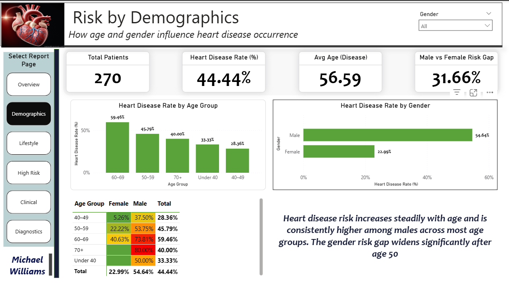

# Heart Disease Prediction Analysis
### A Clinical Data Analytics Project using Power BI

---

## 🔗 Live Dashboard

**👉 Interactive Power BI Report:**  
[https://app.powerbi.com/view?r=YOUR_REPORT_ID_HERE](https://app.powerbi.com/view?r=YOUR_REPORT_ID_HERE)

*Best viewed on desktop. Public access enabled.*

---

## 📊 Project Overview

Cardiovascular disease is one of the leading causes of mortality worldwide. Early identification of high-risk individuals is critical for timely intervention and prevention.

This project applies clinical data analytics and visualization to analyze patient health records and uncover patterns associated with heart disease. Using Power BI, the project transforms raw clinical measurements into meaningful insights for healthcare decision-making, screening, and risk stratification.

This repository represents a complete, end-to-end analytics project, suitable for a professional data analytics portfolio.

---

## 🎯 Project Objectives

- Analyze demographic, lifestyle, and clinical risk factors
- Identify patterns associated with heart disease occurrence
- Define and analyze high-risk patient profiles
- Build an interactive, multi-page Power BI dashboard
- Present insights in a clear, executive-friendly format

---

## 📁 Data Source

- **Dataset:** Heart Disease Prediction Dataset
- **Author:** Nalisha
- **Platform:** Kaggle
- **Records:** 270 patients
- **Features:** 14 clinical variables
- **Target Variable:** Presence or absence of heart disease

**🔗 Dataset Link:**  
[https://www.kaggle.com/datasets/nalisha/heart-disease-prediction-dataset](https://www.kaggle.com/datasets/nalisha/heart-disease-prediction-dataset)

**📌 Dataset file included in this repository:**  
`/dataset/heart_disease_prediction.csv`

--- 

## 🔧 Data Preparation & Feature Engineering

To improve interpretability and storytelling, numeric medical codes were converted into clinically meaningful categories using DAX in Power BI.

**Key engineered features include:**

- Gender (Male / Female)
- Chest Pain Description
- Cholesterol Risk Category
- Diabetes Status
- Exercise-Induced Angina Status
- ECG Interpretation
- ST Segment Slope Description
- Thallium Test Interpretation
- Heart Disease Status (Presence / Absence)

All transformations follow established clinical guidelines (NCEP ATP III, ACC/AHA, ADA).

## Engineered Features (Created in Power BI)

| Column Name | Data Type | Values | Purpose |
|-------------|-----------|--------|---------|
| **Gender** | String | Female, Male | Readable gender labels |
| **Chest_Pain_Description** | String | Typical Angina, Atypical Angina, Non-Anginal Pain, Asymptomatic | Clinical descriptions |
| **Cholesterol_Category** | String | Normal, Borderline High, High | NCEP ATP III risk categories |
| **Diabetes_Status** | String | Normal, Elevated | Blood sugar interpretation |
| **Exercise_Angina_Status** | String | No, Yes | Readable angina status |
| **Heart_Disease_Status** | String | Absence, Presence | Target variable labels |
| **EKG_Description** | String | Normal, ST-T Wave Abnormality, LVH | ECG interpretations |
| **ST_Slope_Description** | String | Upsloping, Flat, Downsloping | Slope interpretations |
| **Thallium_Description** | String | Normal, Fixed Defect, Reversible Defect | Nuclear test interpretations |

<details>
<summary><b>View DAX Formulas</b></summary>

### Gender
```dax
Gender = 
SWITCH(
    heart_disease_data[Sex],
    0, "Female",
    1, "Male",
    "Unknown"
)
```

### Chest Pain Description
```dax
Chest_Pain_Description = 
SWITCH(
    heart_disease_data[Chest_pain_type],
    1, "Typical Angina",
    2, "Atypical Angina",
    3, "Non-Anginal Pain",
    4, "Asymptomatic",
    "Unknown"
)
```

### Cholesterol Category
```dax
Cholesterol_Category = 
SWITCH(
    TRUE(),
    heart_disease_data[Cholesterol] < 200, "Normal",
    heart_disease_data[Cholesterol] <= 239, "Borderline High",
    "High"
)
```

### Diabetes Status
```dax
Diabetes_Status = 
SWITCH(
    TRUE(),
    heart_disease_data[FBS_over_120] = 0, "Normal/Low Risk",
    heart_disease_data[FBS_over_120] = 1, "Elevated Risk (Prediabetes/Diabetes)"
)
```

### Exercise Angina Status
```dax
Exercise_Angina_Status = 
IF(
    heart_disease_data[Exercise_angina] = 0,
    "No",
    "Yes"
)
```

### Heart Disease Status
```dax
Heart_Disease_Status = 
IF(
    heart_disease_data[Heart_Disease] = 0,
    "Absence",
    "Presence"
)
```

### EKG Description
```dax
EKG_Description = 
SWITCH(
    heart_disease_data[EKG_results],
    0, "Normal",
    1, "ST-T Wave Abnormality",
    2, "Left Ventricular Hypertrophy",
    "Unknown"
)
```

### ST Slope Description
```dax
ST_Slope_Description = 
SWITCH(
    heart_disease_data[Slope_of_ST],
    1, "Upsloping",
    2, "Flat",
    3, "Downsloping",
    "Unknown"
)
```

### Thallium Description
```dax
Thallium_Description = 
SWITCH(
    heart_disease_data[Thallium],
    3, "Normal",
    6, "Fixed Defect",
    7, "Reversible Defect",
    "Unknown"
)
```

</details>|

---

## 📊 Power BI Dashboard — Page-by-Page Insights


### 🟦 PAGE 1 — Executive Overview

**Purpose:**  
Provide an instant snapshot of the heart disease burden.


**Key Insights:**
- A significant proportion of patients are affected by heart disease
- Disease prevalence increases sharply with age
- Male patients exhibit higher disease rates than females
- Cholesterol and heart rate metrics differ noticeably between diseased and non-diseased patients

---

### 🟦 PAGE 2 — Demographic Risk Analysis

**Purpose:**  
Understand how age and gender influence disease occurrence.



**Key Insights:**
- Heart disease risk rises markedly after age 50
- Males show consistently higher risk across most age groups
- Age remains the strongest non-modifiable risk factor

---

### 🟦 PAGE 3 — Clinical Risk Indicators

**Purpose:**  
Evaluate symptoms and diagnostic indicators linked to disease.


**Key Insights:**
- Exercise-induced angina strongly correlates with heart disease
- Abnormal ECG results are associated with higher disease rates
- Downsloping and flat ST segments indicate elevated ischemic risk

---

### 🟦 PAGE 4 — Lifestyle & Biomarker Risk

**Purpose:**  
Assess lifestyle-related and biomarker-driven risk factors.


**Key Insights:**
- Elevated cholesterol significantly increases disease likelihood
- Diabetic patients show higher prevalence of heart disease
- Reduced maximum heart rate is associated with poor cardiac reserve
- Combined biomarker elevation signals high-risk profiles

---

### 🟦 PAGE 5 — High-Risk Patient Profile

**Purpose:**  
Identify patients requiring closer clinical attention.


**Key Insights:**
- High-risk classification includes patients with multiple cardiovascular risk factors
- Not all high-risk patients have confirmed heart disease
- Useful for preventive screening and early intervention strategies

**📌 High-Risk Logic Note:**  
High-risk status is determined by a combination of elevated biomarkers and clinical indicators, not solely by confirmed disease presence.

---

### 🟦 PAGE 6 — Diagnostic Test Insights

**Purpose:**  
Analyze advanced diagnostic and imaging results.

)

**Key Insights:**
- Disease prevalence increases with the number of blocked vessels
- Abnormal thallium test results strongly predict disease
- ST depression shows a clear dose–response relationship with risk

---
```

## 📋 Checklist to Complete This:

1. **Create the `images` folder** in your repository:
```

## 🚨 High-Risk Logic Summary

A patient is classified as **High Risk** when multiple clinical risk factors are present, such as:

- Elevated cholesterol
- Abnormal ECG or thallium results
- Exercise-induced angina
- High ST depression
- Reduced maximum heart rate

This approach supports preventive care, not just diagnosis.

---

## 🛠️ Tools & Technologies

- **Power BI Desktop & Service** — Dashboard development & publishing
- **DAX** — Feature engineering & KPI measures
- **SQL-style analytics** — Aggregation logic & metrics
- **GitHub & VS Code** — Version control & documentation

---

## 📚 Medical References

- Diamond & Forrester (1979) — Chest pain classification
- NCEP ATP III (2002) — Cholesterol guidelines
- American Diabetes Association (2021) — Blood sugar standards
- ACC/AHA Exercise Testing Guidelines
- ASNC Nuclear Cardiology Guidelines

All interpretations align with peer-reviewed clinical standards.

---

## 🧠 Key Takeaway

This project demonstrates how clinical data can be transformed into actionable insights using modern analytics tools. The dashboard supports:

- Risk stratification
- Preventive screening
- Data-driven healthcare decision-making

It showcases strong capabilities in Power BI, DAX, healthcare analytics, and storytelling.

---

## 👤 Author

**Adie Michael Akomaye**  
Data Analyst | Power BI | SQL | Healthcare Analytics

📧 **Email: michaelwilliams4232016@gmail.com  
🔗 **LinkedIn: www.linkedin.com/in/michael-akomaye-4381082ba

---